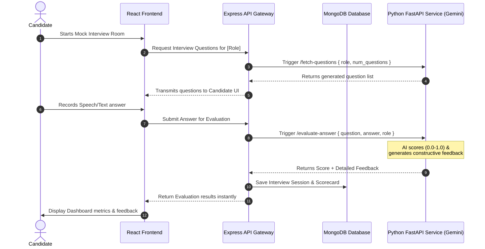

# 🚀 InterviewPrep — AI-Powered Mock Interview Platform

**InterviewPrep** is an advanced, full-stack AI-driven mock interview application designed to help job seekers practice technical, role-specific, and behavioral interviews. It leverages large language models (Google Gemini AI) to generate dynamic, contextual questions and provides real-time scoring, analytical insights, and constructive feedback on candidate answers.

The platform is designed with two distinct workflows:
- **For Candidates**: Practice interview sessions, record verbal responses, receive instant AI evaluations, and track skill improvement on a personal dashboard.
- **For HR / Recruiters**: Configure customized interview rooms for various job roles, manage candidates, schedule evaluations, and review comprehensive assessment scorecards.

---

## 🛠️ Tech Stack & Key Technologies

| Layer | Technologies & Libraries |
| :--- | :--- |
| **Frontend** | React 18, Vite, TypeScript, TailwindCSS v3, HTML5 Speech Recognition API |
| **Backend API** | Node.js, Express, TypeScript, Mongoose (MongoDB ODM), JWT (JSON Web Tokens) |
| **AI Evaluation** | Python, FastAPI, Google Gemini API (`gemini-2.0-flash`), Pydantic |
| **State & Styling** | React Context (Auth, Theme, HR, Interview), Lucide React, Tailwind Theme Variables |

---

## 🏗️ System Architecture & Workflow

The platform follows a microservices-inspired architecture where the frontend coordinates with the Express gateway, and heavy AI completions are offloaded to a specialized Python FastAPI service.



---

## 📂 Repository Directory Structure

```
InterviewPrep/
├── frontend/                # React (Vite + TypeScript) SPA
│   ├── src/
│   │   ├── components/     # UI elements (Candidate & HR dashboards, layouts)
│   │   │   └── Interview/  # Recorder, Progress bar, question navigation UI
│   │   ├── contexts/       # AuthContext, HRContext, InterviewContext, ThemeContext
│   │   ├── pages/          # 22 pages (Homepage, InterviewRoom, Login, FAQ, Tips, etc.)
│   │   ├── lib/            # Utilities, Tailwind wrappers, shared interfaces
│   │   └── main.tsx        # Application mount point
│   ├── vite.config.ts      # Vite configuration
│   └── tailwind.config.js  # Color palette and micro-animation configuration
│
├── backend/                # Node.js + Express API Gateway
│   ├── src/
│   │   ├── lib/            # MongoDB connection (db.ts) and Mongoose models
│   │   │   └── models/     # 11 Schemas (User, Job, Blog, InterviewRoom, etc.)
│   │   ├── server/         # Express server middlewares & routes (12 route endpoints)
│   │   │   └── routes/     # Auth, Admin, Blog, FAQ, Jobs, Interviews, Results routes
│   │   └── index.ts        # Server listener and socket setup
│   └── tsconfig.json       # TypeScript build configuration
│
└── evaluator_service/      # Python FastAPI microservice
    ├── main.py             # FastAPI router & Gemini AI client integration
    ├── requirements.txt    # Python dependencies (fastapi, google-generativeai, etc.)
    └── .env.example        # Environment blueprint for API keys
```

---

## 🚦 Detailed API Endpoints

### 1. Express Backend Gateway (`PORT 5000`)
- **Auth Service**
  - `POST /api/auth/register` — Registers a new Candidate or HR account.
  - `POST /api/auth/login` — Authenticates user credentials and issues a JWT token.
  - `GET /api/auth/me` — Fetches current authenticated user data.
- **Job Board & Careers**
  - `GET /api/jobs` — Retrieves list of job openings.
  - `POST /api/jobs` — (HR only) Publishes a new job role.
- **Interviews & Rooms**
  - `GET /api/interviews` — Fetches candidate's scheduled or active interview sessions.
  - `POST /api/interviews` — Creates or initiates a mock interview room session.
- **Results & Evaluation**
  - `POST /api/results/evaluate` — Coordinates with the evaluator service to analyze and save responses.
  - `GET /api/results/:id` — Retreives details score and feedback for a finished interview.

### 2. Python FastAPI Evaluator Service (`PORT 8001`)
- `GET /health` — Verifies server health status and validates Gemini API key availability.
- `POST /fetch-questions` — Generates a customized list of interview questions.
  - *Payload*: `{ "role": "Frontend Engineer", "num_questions": 5 }`
- `POST /evaluate-answer` — Grades a candidate's response.
  - *Payload*: `{ "question": "Explain closures in JS", "answer": "...", "role": "Frontend" }`
  - *Response*: `{ "score": 0.85, "feedback": "Constructive suggestions here..." }`

---

## 🎨 UI Design System & Micro-Animations

The user interface implements a premium, modern design with an elegant developer aesthetic:
- **Glassmorphism Layouts**: Frosted glass panels (`backdrop-blur-md`) with gradient borders.
- **Theme Adaptability**: Synchronized system-preference tracking for dark and light modes.
- **Interactive States**: Smooth hover scaling, card shimmer effects, and pulsing recording rings to indicate microphone activity.
- **Accessible Typography**: Styled using clean Inter and Outfit typography settings via Google Fonts.

---

## 🚀 Local Setup & Configuration

### Prerequisites
- Node.js (version 18 or higher)
- Python (version 3.10 or higher)
- MongoDB running locally or a MongoDB Atlas URI
- A Google Gemini API Key

---

### Step 1: Clone and Prepare Environment Variables

1. Create a `.env` in the `backend/` directory:
   ```env
   PORT=5000
   MONGODB_URI=mongodb://localhost:27017/interviewprep
   JWT_SECRET=your_super_secret_jwt_token_key
   EVALUATOR_SERVICE_URL=http://localhost:8001
   ```

2. Create a `.env` in the `evaluator_service/` directory:
   ```env
   GEMINI_API_KEY=AIzaSyYourGeminiApiKeyHere
   ```

---

### Step 2: Running the Services

#### A. Run the Backend API Gateway
```bash
cd backend
npm install
npm run dev
```
The gateway will run at `http://localhost:5000`.

#### B. Run the FastAPI Evaluator Service
```bash
cd evaluator_service
# Set up a virtual environment (optional but recommended)
python -m venv venv
venv\Scripts\activate      # On Windows (cmd)
source venv/bin/activate   # On Linux/macOS

pip install -r requirements.txt
python main.py
```
The evaluator service will run at `http://localhost:8001`.

#### C. Run the React Frontend
```bash
cd frontend
npm install
npm run dev
```
Open your browser and navigate to `http://localhost:5173`.

---

## 📄 License

This repository is licensed under the **MIT License**. Feel free to use it for educational purposes or as a foundation for building remote technical interview tools.
